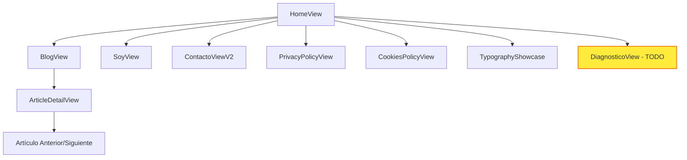

# Documentación de Páginas

Este directorio contiene la documentación detallada de cada página/vista del proyecto juanda.pro.

## 📋 Índice de Páginas

### Páginas Principales
1. **[HomeView](./01_HomeView.md)** - Página principal del sitio
2. **[BlogView](./02_BlogView.md)** - Listado de artículos del blog
3. **[ArticleDetailView](./03_ArticleDetailView.md)** - Vista detalle de artículo
4. **[SoyView](./04_SoyView.md)** - Página "Acerca de mí"
5. **[ContactoViewV2](./05_ContactoViewV2.md)** - Formulario de contacto

### Páginas Legales
6. **[PrivacyPolicyView](./06_PrivacyPolicyView.md)** - Política de privacidad
7. **[CookiesPolicyView](./07_CookiesPolicyView.md)** - Política de cookies

### Páginas Especiales
8. **[TypographyShowcase](./08_TypographyShowcase.md)** - Showcase de tipografías
9. **[DiagnosticoView](./09_DiagnosticoView.md)** - Formulario de diagnóstico (planificado)

## 🗺️ Mapa de Navegación

## 📊 Rutas del Sistema

| Ruta | Componente | Descripción | Estado |
|------|------------|-------------|--------|
| `/` | HomeView | Página principal | ✅ Activa |
| `/blog` | BlogView | Lista de artículos | ✅ Activa |
| `/blog/:slug` | ArticleDetailView | Detalle de artículo | ✅ Activa |
| `/soy` | SoyView | Acerca de mí | ✅ Activa |
| `/contacto` | ContactoViewV2 | Formulario contacto | ✅ Activa |
| `/politica-de-privacidad` | PrivacyPolicyView | Política privacidad | ✅ Activa |
| `/politica-de-cookies` | CookiesPolicyView | Política cookies | ✅ Activa |
| `/typography-showcase` | TypographyShowcase | Demo tipografías | ✅ Activa |
| `/diagnostico` | HomeView (placeholder) | Formulario diagnóstico | 🚧 Planificado |

## 🎯 Propósito de Cada Página

### Páginas de Conversión
- **HomeView:** Primera impresión, presentación profesional
- **SoyView:** Construcción de confianza, credibilidad
- **ContactoViewV2:** Generación de leads, conversión

### Páginas de Contenido
- **BlogView:** Demostración de expertise, SEO
- **ArticleDetailView:** Engagement profundo, autoridad

### Páginas de Soporte
- **PrivacyPolicyView:** Cumplimiento legal, confianza
- **CookiesPolicyView:** Cumplimiento GDPR
- **TypographyShowcase:** Testing y desarrollo

## 📱 Responsive Behavior

Todas las páginas implementan:
- **Mobile-first design**
- **Breakpoints estándar:** sm (640px), md (768px), lg (1024px), xl (1280px)
- **Touch-friendly interactions**
- **Optimización de performance en móvil**

## 🎨 Consistencia de Diseño

### Elementos Comunes
- **Header:** Navegación principal en todas las páginas
- **Footer:** Información de contacto y links legales
- **Theme toggle:** Modo claro/oscuro
- **Transiciones:** Fade entre páginas
- **Loading states:** Para contenido dinámico

### Patrones de Layout
- **PageLayout:** Wrapper común para páginas estándar
- **LegalPageLayout:** Layout específico para páginas legales
- **SectionWrapper:** Contenedor con padding consistente

## 🔍 SEO y Metadatos

Cada página debe incluir:
- **Title tag** único y descriptivo
- **Meta description** optimizada
- **Open Graph tags** para redes sociales
- **Structured data** cuando aplique
- **Canonical URLs** para evitar contenido duplicado

## 📈 Analytics y Tracking

### Eventos Importantes
- **Page views:** Todas las páginas
- **Form submissions:** Contacto y diagnóstico
- **Article reads:** Tiempo en página, scroll depth
- **Navigation:** Clicks en menú, CTAs

### Conversiones
- **Contact form:** Envío exitoso
- **Article engagement:** Lectura completa
- **Social shares:** Compartir contenido

## 🔄 Estados de Carga

### Loading States
- **Initial load:** Skeleton screens
- **Navigation:** Smooth transitions
- **Form submission:** Loading indicators
- **Error states:** Mensajes informativos

### Error Handling
- **404 pages:** Redirección a home
- **Network errors:** Retry mechanisms
- **Form errors:** Validación en tiempo real

## 🚀 Performance Considerations

### Optimizaciones Implementadas
- **Lazy loading:** Rutas y componentes pesados
- **Code splitting:** Por página
- **Image optimization:** Formatos modernos, lazy loading
- **Critical CSS:** Inline para above-the-fold

### Métricas Objetivo
- **LCP:** < 2.5s
- **FID:** < 100ms
- **CLS:** < 0.1
- **TTI:** < 3.5s

## 🔮 Roadmap de Páginas

### Próximas Implementaciones
1. **DiagnosticoView:** Formulario de diagnóstico empresarial
2. **PortfolioView:** Showcase de proyectos
3. **ServiciosView:** Descripción de servicios ofrecidos
4. **TestimonialsView:** Testimonios de clientes

### Mejoras Planificadas
1. **Search functionality:** Búsqueda en blog
2. **Related articles:** Recomendaciones
3. **Newsletter signup:** Suscripción a newsletter
4. **Social sharing:** Botones de compartir mejorados

## 📝 Convenciones de Documentación

Cada página documentada incluye:
- **Propósito y objetivos**
- **Componentes utilizados**
- **Props y configuración**
- **Estados y interacciones**
- **Responsive behavior**
- **SEO considerations**
- **Performance notes**
- **Testing scenarios**