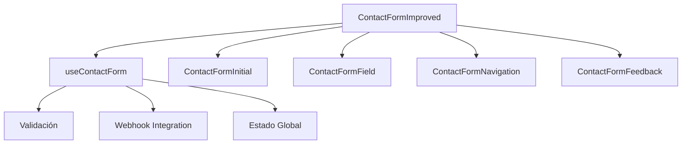

# ContactForm - Documentación del Componente

## 1. Información General

**Propósito**: Sistema de formulario de contacto multi-paso con navegación intuitiva, validación en tiempo real, integración con webhook y experiencia de usuario optimizada.

**Componente Principal**: `src/components/ContactFormImproved.vue`

**Tipo**: Sistema de formulario interactivo modular

**Estado**: ✅ Implementado y funcional

## 2. Arquitectura del Sistema

### Componentes Principales

| Componente | Ubicación | Propósito |
|------------|-----------|----------|
| `ContactFormImproved.vue` | `src/components/` | Componente principal que orquesta todo el sistema |
| `ContactFormNavigation.vue` | `src/components/` | Navegación entre pasos (Anterior/Siguiente/Enviar) |
| `ContactFormInitial.vue` | `src/components/` | Estado inicial colapsado del formulario |
| `ContactFormField.vue` | `src/components/` | Campo de entrada individual con validación |
| `ContactFormFeedback.vue` | `src/components/` | Mensajes de feedback y estados de envío |
| `useContactForm.ts` | `src/composables/` | Lógica de negocio y estado del formulario |

### Flujo de Datos



## 3. Funcionalidades Principales

### 3.1 Sistema Multi-Paso

**Pasos del Formulario:**
1. **Nombre** (Paso 1): Campo de texto para nombre completo
2. **Email** (Paso 2): Campo de email con validación avanzada
3. **Mensaje** (Paso 3): Área de texto para el mensaje

**Características:**
- Navegación secuencial con validación por paso
- Barra de progreso visual animada
- Auto-focus en campos al cambiar de paso
- Navegación por teclado (Enter para avanzar)

### 3.2 Estados del Formulario

| Estado | Descripción | Componente Activo |
|--------|-------------|------------------|
| `Colapsado` | Estado inicial con input placeholder | `ContactFormInitial` |
| `Expandido` | Formulario multi-paso activo | `ContactFormField` + `ContactFormNavigation` |
| `Enviando` | Estado de loading durante envío | `ContactFormFeedback` |
| `Éxito` | Confirmación de envío exitoso | `ContactFormFeedback` |
| `Error` | Mensaje de error en envío | `ContactFormFeedback` |

### 3.3 Validación Inteligente

**Validación en Tiempo Real:**
- Validación inmediata al escribir
- Estados visuales de validez/invalidez
- Mensajes de error contextuales
- Bloqueo de navegación hasta validación exitosa

**Reglas de Validación:**
- **Nombre**: Requerido, máximo 100 caracteres
- **Email**: Requerido, formato válido (`/\S+@\S+\.\S+/`), máximo 150 caracteres
- **Mensaje**: Requerido, máximo 1000 caracteres

### 3.4 Integración con Webhook

**Características:**
- Envío a webhook n8n configurado
- Autenticación con header personalizado
- Rate limiting (30 segundos entre envíos)
- Logging detallado para debugging
- Manejo robusto de errores

## 4. API del Componente Principal

### ContactFormImproved.vue

**Props:** Ninguna (autocontenido)

**Eventos:** Ninguno (manejo interno)

**Métodos Expuestos:** Ninguno (encapsulado)

### useContactForm Composable

**Estado Reactivo:**
```typescript
interface FormData {
  name: string
  email: string
  message: string
}

const isFormExpanded = ref(false)
const currentStep = ref(0)
const isSubmitting = ref(false)
const submitStatus = ref<'success' | 'error' | null>(null)
const webhookStatus = ref<'success' | 'error' | null>(null)
const formData = reactive<FormData>({ name: '', email: '', message: '' })
const validationErrors = ref<Record<string, string>>({})
```

**Métodos Principales:**
- `expandForm()`: Expande el formulario desde estado inicial
- `nextStep()`: Avanza al siguiente paso (con validación)
- `prevStep()`: Retrocede al paso anterior
- `validateField(field, value)`: Valida un campo específico
- `handleSubmit()`: Procesa el envío del formulario
- `resetForm()`: Resetea el formulario a estado inicial

## 5. Estilos y Diseño

### 5.1 Paleta de Colores Actualizada

**Colores Principales:**
- **Acento Claro**: `#206372` (azul corporativo)
- **Acento Oscuro**: `#F5DF4D` (amarillo dorado)
- **Fondo Cards Claro**: `#FFFFFF` (blanco)
- **Fondo Cards Oscuro**: `#191A1D` (gris oscuro)
- **Texto Claro**: `#262626` (gris oscuro)
- **Texto Oscuro**: `#F4F4F4` (gris muy claro)

**Estados de Error:**
- **Error Claro**: `#DC2626` (rojo)
- **Error Oscuro**: `#EF4444` (rojo claro)

### 5.2 Componentes Visuales

**Barra de Progreso:**
```css
/* Progreso visual con colores de acento */
.progress-bar {
  background: linear-gradient(to right, 
    #206372, 
    #F5DF4D);
}
```

**Campos de Entrada:**
- Bordes con `border-[#206372] dark:border-[#F5DF4D]`
- Estados hover y focus con colores de acento
- Animaciones de entrada (`slideInUp`)
- Validación visual en tiempo real

**Botones:**
- Estilo primario: `bg-[#206372] dark:bg-[#F5DF4D]`
- Estados disabled con opacidad reducida
- Efectos hover con transformaciones
- Loading states durante envío

### 5.3 Responsive Design

**Breakpoints:**
- **Mobile**: Layout vertical, controles simplificados
- **Tablet**: Espaciado intermedio
- **Desktop**: Layout optimizado con efectos hover

**Optimizaciones Móviles:**
- `font-size: 16px` para evitar zoom en iOS
- Botones de tamaño táctil adecuado
- Espaciado adaptativo
- Textarea responsive

## 6. Configuración y Variables de Entorno

### Variables Requeridas

```env
VITE_WEBHOOK_URL=https://tu-webhook-n8n.com/webhook/contacto
VITE_WEBHOOK_TOKEN=tu-token-secreto
```

### Configuración del Webhook

**Método:** GET (requerido por n8n)
**Headers de Autenticación:**
```javascript
headers: {
  'contact_form': 'jJkKI()/55dÑLdk55'
}
```

**Datos Enviados:**
- `timestamp`: Fecha/hora en zona horaria de Madrid
- `name`: Nombre sanitizado
- `email`: Email sanitizado
- `message`: Mensaje sanitizado

## 7. Funcionalidades Avanzadas

### 7.1 Rate Limiting
- Previene spam con límite de 30 segundos entre envíos
- Mensaje de error con countdown
- Tracking de último envío en memoria

### 7.2 Sanitización de Datos
- Eliminación de scripts maliciosos
- Limpieza de HTML tags
- Trim de espacios en blanco

### 7.3 Logging y Debugging
- Logging detallado en consola
- Función de prueba global: `window.testWebhookDebug()`
- Tracking de estados de validación
- Monitoreo de performance de webhook

### 7.4 Manejo de Errores
- Errores de red y conectividad
- Errores de validación
- Errores de webhook
- Fallback graceful en caso de fallo

## 8. Accesibilidad

### Navegación por Teclado
- ✅ `Tab` para navegación secuencial
- ✅ `Enter` para avanzar pasos
- ✅ Focus management automático
- ✅ Focus rings visibles

### Screen Readers
- ✅ `aria-label` en todos los campos
- ✅ `aria-required` para campos obligatorios
- ✅ Labels asociados correctamente
- ✅ Estados de error anunciados

### Estándares WCAG
- ✅ Contraste de colores adecuado
- ✅ Tamaños de botón táctiles
- ✅ Feedback visual y auditivo
- ✅ Navegación predecible

## 9. Performance

### Optimizaciones
- **Validación eficiente**: Solo cuando es necesario
- **Re-renders mínimos**: Uso optimizado de reactive
- **Animaciones CSS**: Hardware-accelerated
- **Lazy loading**: Componentes bajo demanda

### Métricas
- Bundle size optimizado
- Sin dependencias externas pesadas
- CSS scoped para evitar conflictos
- Debouncing en validación

## 10. Testing

### Casos de Prueba Principales

**Funcionalidad:**
- ✅ Expansión del formulario
- ✅ Navegación entre pasos
- ✅ Validación de campos
- ✅ Envío exitoso
- ✅ Manejo de errores
- ✅ Reset del formulario

**Integración:**
- ✅ Comunicación entre componentes
- ✅ Estado compartido
- ✅ Webhook integration
- ✅ Rate limiting

**UX:**
- ✅ Flujo completo de usuario
- ✅ Estados visuales
- ✅ Responsive design
- ✅ Accesibilidad

## 11. Mantenimiento y Monitoreo

### Métricas Clave
- Tasa de conversión por paso
- Errores de validación frecuentes
- Performance de webhook
- Abandono en pasos específicos

### Actualizaciones Regulares
- Testing de accesibilidad
- Optimización de validaciones
- Revisión de UX
- Actualización de dependencias

### Debugging
- Función de prueba: `window.testWebhookDebug()`
- Logs detallados en consola
- Tracking de estados de validación
- Monitoreo de errores de red

## 12. Roadmap de Mejoras

### Corto Plazo
- [ ] Persistencia local de datos
- [ ] Mejoras en validación de email
- [ ] Optimización de animaciones
- [ ] Tests automatizados

### Mediano Plazo
- [ ] Integración con múltiples webhooks
- [ ] Formularios dinámicos
- [ ] Analytics avanzado
- [ ] Notificaciones push

### Largo Plazo
- [ ] AI assistance para validación
- [ ] Formularios conversacionales
- [ ] A/B testing integrado
- [ ] Optimización predictiva

## 13. Consideraciones Técnicas

### Dependencias
- **Vue 3**: Composition API, reactive, computed
- **Tailwind CSS**: Sistema de utilidades
- **Heroicons**: Iconografía
- **TypeScript**: Tipado estático

### Compatibilidad
- **Navegadores**: Modernos (ES2020+)
- **Dispositivos**: Mobile-first responsive
- **Accesibilidad**: WCAG 2.1 AA
- **Performance**: Core Web Vitals optimizado

### Seguridad
- Sanitización de inputs
- Rate limiting
- Validación client-side y server-side
- Headers de autenticación seguros

Este documento refleja el estado actual del sistema ContactForm implementado en el proyecto, basado en el código fuente real y las funcionalidades actualmente disponibles.