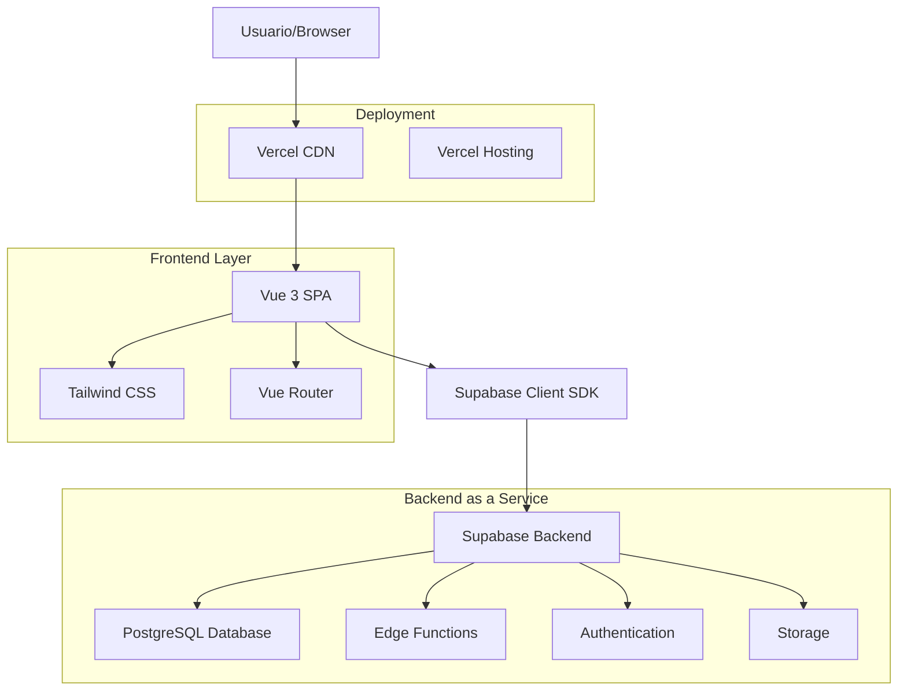
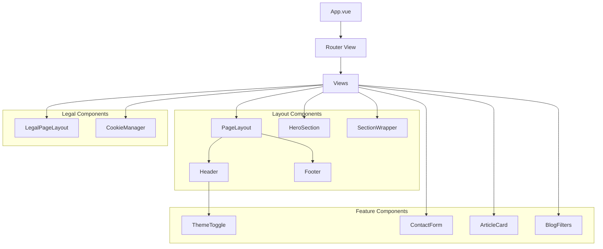
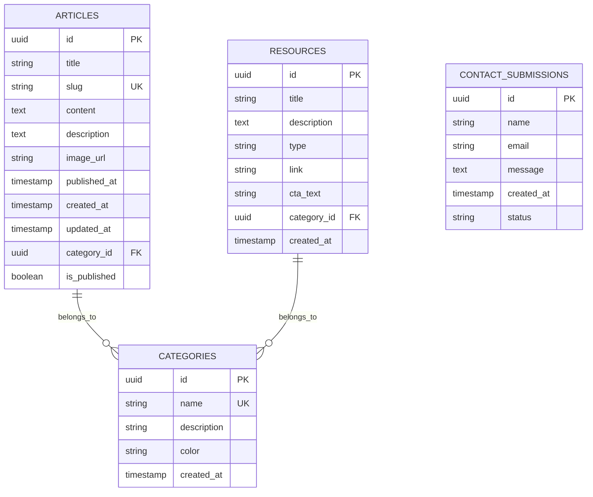

# Arquitectura Técnica - juanda.pro

## 1. Arquitectura General



## 2. Stack Tecnológico

### Frontend
- **Vue 3** `^3.4.21` - Framework principal con Composition API
- **Vue Router** `^4.3.0` - Enrutamiento SPA
- **Tailwind CSS** `^3.x` - Framework de utilidades CSS
- **TypeScript** - Tipado estático
- **Vite** - Build tool y dev server

### Backend (BaaS)
- **Supabase** - Backend as a Service
  - PostgreSQL Database
  - Authentication
  - Edge Functions
  - Real-time subscriptions
  - Storage

### Deployment
- **Vercel** - Hosting y CDN
- **Domain**: juanda.pro

### Herramientas de Desarrollo
- **ESLint** - Linting de código
- **TypeScript Compiler** - Verificación de tipos
- **Git** - Control de versiones

## 3. Definiciones de Rutas

| Ruta | Propósito | Componente |
|------|-----------|------------|
| `/` | Página principal del sitio | HomeView |
| `/blog` | Lista de artículos del blog | BlogView |
| `/blog/:slug` | Detalle de artículo específico | ArticleDetailView |
| `/soy` | Página "Acerca de mí" | SoyView |
| `/contacto` | Formulario de contacto | ContactoViewV2 |
| `/politica-de-privacidad` | Política de privacidad | PrivacyPolicyView |
| `/politica-de-cookies` | Política de cookies | CookiesPolicyView |
| `/typography` | Showcase tipográfico (desarrollo) | TypographyShowcase |

## 4. Arquitectura de Componentes

### Jerarquía de Componentes



## 5. Modelo de Datos

### 5.1 Definición del Modelo



### 5.2 Esquemas de Base de Datos

#### Tabla Articles
```sql
CREATE TABLE articles (
    id UUID PRIMARY KEY DEFAULT gen_random_uuid(),
    title VARCHAR(255) NOT NULL,
    slug VARCHAR(255) UNIQUE NOT NULL,
    content TEXT,
    description TEXT,
    image_url VARCHAR(500),
    published_at TIMESTAMP WITH TIME ZONE,
    created_at TIMESTAMP WITH TIME ZONE DEFAULT NOW(),
    updated_at TIMESTAMP WITH TIME ZONE DEFAULT NOW(),
    category_id UUID REFERENCES categories(id),
    is_published BOOLEAN DEFAULT false
);

-- Índices
CREATE INDEX idx_articles_slug ON articles(slug);
CREATE INDEX idx_articles_published_at ON articles(published_at DESC);
CREATE INDEX idx_articles_category ON articles(category_id);
```

#### Tabla Categories
```sql
CREATE TABLE categories (
    id UUID PRIMARY KEY DEFAULT gen_random_uuid(),
    name VARCHAR(100) UNIQUE NOT NULL,
    description TEXT,
    color VARCHAR(7) DEFAULT '#6B7280',
    created_at TIMESTAMP WITH TIME ZONE DEFAULT NOW()
);

-- Datos iniciales
INSERT INTO categories (name, description, color) VALUES
('Vue.js', 'Artículos sobre Vue.js y su ecosistema', '#4FC08D'),
('JavaScript', 'Conceptos y técnicas de JavaScript', '#F7DF1E'),
('CSS', 'Estilos, animaciones y diseño web', '#1572B6'),
('Desarrollo Web', 'Temas generales de desarrollo web', '#61DAFB'),
('Tutoriales', 'Guías paso a paso', '#FF6B6B'),
('Reflexiones', 'Pensamientos sobre desarrollo y tecnología', '#9B59B6');
```

#### Tabla Resources
```sql
CREATE TABLE resources (
    id UUID PRIMARY KEY DEFAULT gen_random_uuid(),
    title VARCHAR(255) NOT NULL,
    description TEXT,
    type VARCHAR(50),
    link VARCHAR(500),
    cta_text VARCHAR(100),
    category_id UUID REFERENCES categories(id),
    created_at TIMESTAMP WITH TIME ZONE DEFAULT NOW()
);
```

#### Tabla Contact Submissions
```sql
CREATE TABLE contact_submissions (
    id UUID PRIMARY KEY DEFAULT gen_random_uuid(),
    name VARCHAR(255) NOT NULL,
    email VARCHAR(255) NOT NULL,
    message TEXT NOT NULL,
    created_at TIMESTAMP WITH TIME ZONE DEFAULT NOW(),
    status VARCHAR(50) DEFAULT 'pending'
);
```

## 6. Configuración de Supabase

### Row Level Security (RLS)

```sql
-- Habilitar RLS en todas las tablas
ALTER TABLE articles ENABLE ROW LEVEL SECURITY;
ALTER TABLE categories ENABLE ROW LEVEL SECURITY;
ALTER TABLE resources ENABLE ROW LEVEL SECURITY;
ALTER TABLE contact_submissions ENABLE ROW LEVEL SECURITY;

-- Políticas para articles (solo lectura pública para artículos publicados)
CREATE POLICY "Articles are viewable by everyone" ON articles
    FOR SELECT USING (is_published = true);

-- Políticas para categories (lectura pública)
CREATE POLICY "Categories are viewable by everyone" ON categories
    FOR SELECT USING (true);

-- Políticas para resources (lectura pública)
CREATE POLICY "Resources are viewable by everyone" ON resources
    FOR SELECT USING (true);

-- Políticas para contact_submissions (solo inserción)
CREATE POLICY "Anyone can submit contact form" ON contact_submissions
    FOR INSERT WITH CHECK (true);
```

### Permisos de Roles

```sql
-- Permisos para rol anon (usuarios no autenticados)
GRANT SELECT ON articles TO anon;
GRANT SELECT ON categories TO anon;
GRANT SELECT ON resources TO anon;
GRANT INSERT ON contact_submissions TO anon;

-- Permisos para rol authenticated (usuarios autenticados)
GRANT ALL PRIVILEGES ON articles TO authenticated;
GRANT ALL PRIVILEGES ON categories TO authenticated;
GRANT ALL PRIVILEGES ON resources TO authenticated;
GRANT ALL PRIVILEGES ON contact_submissions TO authenticated;
```

## 7. Edge Functions

### Contact Form Handler

**Ubicación**: `supabase/functions/contact-form/index.ts`

**Propósito**: Procesar envíos del formulario de contacto y enviar notificaciones por email.

```typescript
// Estructura básica de la función
serve(async (req) => {
  // Manejar CORS
  if (req.method === 'OPTIONS') {
    return new Response('ok', { headers: corsHeaders })
  }

  try {
    const { name, email, message } = await req.json()
    
    // Validación de datos
    // Inserción en base de datos
    // Envío de email
    
    return new Response(JSON.stringify({ message: 'Email sent successfully' }), {
      headers: { ...corsHeaders, 'Content-Type': 'application/json' },
      status: 200,
    })
  } catch (error) {
    return new Response(JSON.stringify({ error: error.message }), {
      headers: { ...corsHeaders, 'Content-Type': 'application/json' },
      status: 500,
    })
  }
})
```

## 8. Configuración de Build y Deployment

### Vite Configuration

```typescript
// vite.config.ts
export default defineConfig({
  plugins: [vue()],
  resolve: {
    alias: {
      '@': fileURLToPath(new URL('./src', import.meta.url))
    }
  }
})
```

### TypeScript Configuration

```json
{
  "compilerOptions": {
    "target": "ESNext",
    "module": "ESNext",
    "moduleResolution": "node",
    "strict": true,
    "jsx": "preserve",
    "lib": ["ESNext", "DOM"],
    "baseUrl": ".",
    "paths": {
      "@/*": ["src/*"]
    }
  }
}
```

### Vercel Configuration

```json
{
  "rewrites": [
    { "source": "/(.*)", "destination": "/index.html" }
  ]
}
```

## 9. Sistema de Temas

### Configuración Tailwind

```javascript
// tailwind.config.js
module.exports = {
  darkMode: 'class',
  theme: {
    extend: {
      colors: {
        // Sistema de colores personalizado basado en paleta verificada
        'brand-accent-light': '#206372',  // Azul corporativo para modo claro
        'brand-accent-dark': '#F5DF4D',   // Amarillo dorado para modo oscuro
        // Colores de fondo
        'body-light': '#F5F5F5',
        'body-dark': '#1D1E23',
        'surface-light': '#FFFFFF',
        'surface-dark': '#191A1D',
        // Colores de texto
        'text-light': '#262626',
        'text-dark': '#F4F4F4'
      },
      fontFamily: {
        sans: ['"Figtree"', 'sans-serif'],
        serif: ['"Lora"', 'serif'],
        heading: ['"Plus Jakarta Sans"', 'sans-serif']
      }
    }
  }
}
```

## 10. SEO y Meta Tags

### Configuración Base

```html
<!-- index.html -->
<title>Juan David - Desarrollador Full Stack | Blog Personal y Proyectos</title>
<meta name="description" content="Blog personal de Juan David, desarrollador full stack especializado en Vue.js, Node.js y tecnologías web modernas.">
<meta name="keywords" content="Juan David, desarrollador, full stack, Vue.js, JavaScript, Node.js">
<link rel="canonical" href="https://juanda.pro">

<!-- Open Graph -->
<meta property="og:title" content="Juan David - Desarrollador Full Stack">
<meta property="og:description" content="Blog personal y proyectos de desarrollo web">
<meta property="og:url" content="https://juanda.pro">
<meta property="og:type" content="website">

<!-- Twitter Cards -->
<meta name="twitter:card" content="summary_large_image">
<meta name="twitter:title" content="Juan David - Desarrollador Full Stack">
```

### Structured Data

```json
{
  "@context": "https://schema.org",
  "@type": "Person",
  "name": "Juan David",
  "url": "https://juanda.pro",
  "jobTitle": "Desarrollador Full Stack",
  "sameAs": [
    "https://github.com/juandavid",
    "https://linkedin.com/in/juandavid"
  ]
}
```

## 11. Performance y Optimización

### Estrategias Implementadas

1. **SPA con Vue Router**: Navegación sin recargas
2. **Lazy Loading**: Componentes cargados bajo demanda
3. **Vite**: Build tool optimizado
4. **Tailwind CSS**: Purging automático de CSS no utilizado
5. **Vercel CDN**: Distribución global de contenido
6. **Image Optimization**: Pendiente de implementar

### Métricas Objetivo

- **First Contentful Paint**: < 1.5s
- **Largest Contentful Paint**: < 2.5s
- **Cumulative Layout Shift**: < 0.1
- **First Input Delay**: < 100ms

## 12. Seguridad

### Medidas Implementadas

1. **Row Level Security**: En Supabase
2. **CORS**: Configurado en Edge Functions
3. **Input Validation**: En formularios
4. **HTTPS**: Forzado por Vercel
5. **Content Security Policy**: Pendiente

### Consideraciones

- No hay autenticación de usuarios implementada
- Datos públicos principalmente
- Formulario de contacto como único punto de entrada de datos

## 13. Monitoreo y Analytics

### Herramientas Planificadas

1. **Vercel Analytics**: Métricas de performance
2. **Google Analytics**: Comportamiento de usuarios
3. **Supabase Dashboard**: Métricas de base de datos
4. **Error Tracking**: Pendiente (Sentry)

## 14. Roadmap Técnico

### Q3 2025
- [ ] Implementar lazy loading de imágenes
- [ ] Optimización de bundle size
- [ ] Content Security Policy
- [ ] Error tracking

### Q4 2025
- [ ] PWA capabilities
- [ ] Image optimization service
- [ ] Advanced caching strategies
- [ ] Performance monitoring

### Q1 2026
- [ ] Internationalization
- [ ] Advanced SEO features
- [ ] A/B testing framework
- [ ] Advanced analytics